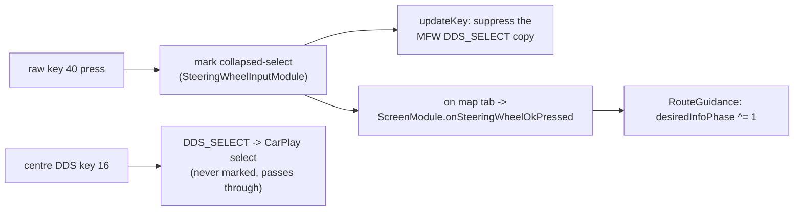

# Steering-wheel roller - zoom & route-info toggle

The left MFW roller has two axes: **rotation** and **press**. Rotation zooms the stock cluster map
and, while the AltScreen CarPlay video is on the cluster, the iPhone's cluster map too; the press
toggles the route-info line.

## 📋 Context

> MFW roller -> **rotation** = stock native-map zoom - **press** = cluster route-info toggle ->
> [bap-fctids](../rgd/bap-fctids.md) FctID 19 -> [rgd-activation](../rgd/rgd-activation.md).

## 🔄 Rotation (zoom) -> stock, and the CarPlay cluster map under AltScreen

The roller sends rotation as Navigation-BAP `MapScale.steps`; stock adds them to the cluster map's
zoom index (`CombiBAPListener.setMapScale` -> `increment(400476, steps)`), which grows with the shown
distance, so a positive step zooms out. `ScreenCombiBAPListener.setMapScale` always lets the step
through to stock, which zooms the native cluster map exactly as stock does.

While the AltScreen CarPlay video covers that map (`ScreenModule.isAltScreenVideo()`, ctx 81),
`AltScreenCluster` also sends the step to the hook (`CMD_ALT_ZOOM`, `[i8 steps]`). The hook
(`hook/altcluster`) turns each step into the AirPlay session command a factory cluster sends:

```
{type: "changeMapZoomLevel", params: {uuid: <AltScreen cluster display>, zoomDirection: 0 in | 1 out}}
```

via `AirPlayReceiverSessionSendCommand` (at most 4 per event). On the phone (iOS 26.1) CarKit forwards
it as an unhandled remote event to DashBoard's `DBInstrumentClusterRootViewController`, which checks
`uuid` against the cluster display and zooms the cluster map (`CRSUIClusterZoomAction`). The live
AirPlay session is tracked through the PLT-bound `AirPlayReceiverSessionPlatformInitialize` /
`...Finalize`; a command is sent under the lock Finalize takes, so it never reaches a freed session.
AltScreen's display UUID is fixed (`b7e6c5a0-2222-4000-8000-000000000002`).

The same path carries `CMD_ALT_UICTX` (a `maps:/car/instrumentcluster` URL -> `showUI`), sent when
the video comes up. With no `/mnt/app/root/hooks/cluster_ui.url`, Java requests
`maps:/car/instrumentcluster/map?maneuverLayout=topaligned`. A saved file takes precedence;
the MMI-Cockpit-Carplay GEM menu writes it ("Cluster map layout": original AltScreen /
card on top (default) / card on the right / no ETA). Original AltScreen explicitly saves
the base URL; it does not remove the file. Upgrades leave saved choices untouched. (The listener
also observes FctID 44 visibility and FctID 54 stage for the KDK layers - see
[kdk-geometry](../cluster/kdk-geometry.md).)

## Open: Google Maps layout does not stay centered

On 2026-09-27 the owner reported working navigation text/distance, but intermittent
Google Maps centering: the first one or few navigations can be centered and later
navigation can revert to an off-center vehicle icon. No reliable trigger is known.
The last prepared test card was `cb64eee`; the later native-MMI build had not been
deployed. Earlier owner feedback said Apple Maps did not have this offset.

The current Java path sends the selected layout from `AltScreenCluster.onVideoReady`,
called on a readiness edge in `ScreenModule.refreshAltScreenVideo`. It does not
explicitly resend on every new route. A later route/UI transition while the same
video stream remains ready is a plausible explanation, **not a confirmed cause**.

Compare first/subsequent routes within one connection, recording app/iOS versions,
video readiness, route state and `showUI` events. Compare raw second-screen video
with the displayed crop before changing geometry. Do not assume a new route means
a new Type-111 stream, repeatedly force `showUI` without evidence, or globally
shift the image and break Apple Maps. The top-card preset is not a guaranteed
centering fix.

## ⚙️ Press (OK) -> route-info toggle

The raw MFW roller press (DSI key 40, `KEY_MFW_ROLLER_LEFT`) and the centre-console DDS (key 16,
`KEY_DDS`) both collapse to the same `DDS_SELECT` in the stock keyboard stack. `SteeringWheelInputModule`
observes the raw `ATTR_KEY2` stream and marks only key 40, so `CarplayDSILifecycleController.updateKey`
can **suppress that one copy** of `DDS_SELECT` before it reaches iOS (via `consumeCollapsedSelect`) -
the centre knob still selects in the CarPlay Main UI.

Gated to the confirmed VC map tab, the press then calls `ScreenModule.onSteeringWheelOkPressed()` ->
`RouteGuidance` toggles the cluster route-info line between the **next turn-to street** (phase 0) and
the **trip summary** (ETA / arrival clock + remaining, phase 1). Phase 1 falls back to phase 0 by
itself 20 s after it was published. Text layout: [vc-route-text](../rgd/vc-route-text.md) (FctID 19).


