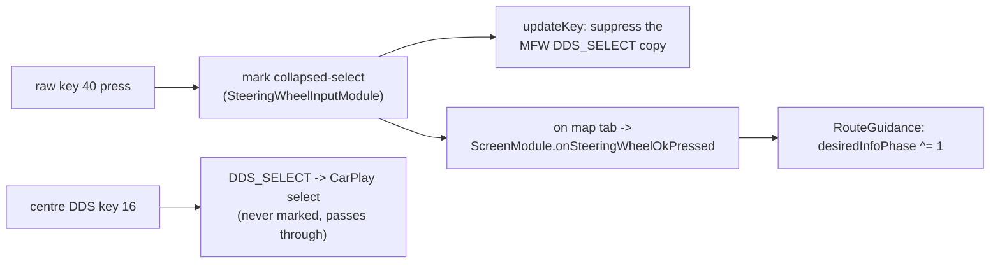

# Steering-wheel roller - zoom & route-info toggle

The left MFW roller has two axes: **rotation** and **press**. Rotation zooms the stock cluster map
and, while the AltScreen CarPlay video is on the cluster, the iPhone's cluster map too; the press
toggles the route-info line.

## 📋 Context

> MFW roller -> **rotation** = stock native-map zoom - **press** = cluster route-info toggle ->
> [bap-fctids](../rgd/bap-fctids.md) FctID 19 -> [rgd-activation](../rgd/rgd-activation.md).

## 🔄 Rotation (zoom) -> stock, and the CarPlay cluster map under AltScreen

The roller sends rotation as Navigation-BAP `MapScale.steps`; stock adds them to the cluster map's
zoom index (`CombiBAPListener.setMapScale` -> `increment(400476, steps)`), which grows with the shown
distance, so a positive step zooms out. `ScreenCombiBAPListener.setMapScale` always lets the step
through to stock, which zooms the native cluster map exactly as stock does.

While the AltScreen CarPlay video covers that map (`ScreenModule.isAltScreenVideo()`, ctx 81),
`AltScreenCluster` also sends the step to the hook (`CMD_ALT_ZOOM`, `[i8 steps]`). The hook
(`hook/altcluster`) turns each step into the AirPlay session command a factory cluster sends:

```
{type: "changeMapZoomLevel", params: {uuid: <AltScreen cluster display>, zoomDirection: 0 in | 1 out}}
```

via `AirPlayReceiverSessionSendCommand` (at most 4 per event). On the phone (iOS 26.1) CarKit forwards
it as an unhandled remote event to DashBoard's `DBInstrumentClusterRootViewController`, which checks
`uuid` against the cluster display and zooms the cluster map (`CRSUIClusterZoomAction`). The live
AirPlay session is tracked through the PLT-bound `AirPlayReceiverSessionPlatformInitialize` /
`...Finalize`; a command is sent under the lock Finalize takes, so it never reaches a freed session.
AltScreen's display UUID is fixed (`b7e6c5a0-2222-4000-8000-000000000002`).

The same path carries `CMD_ALT_UICTX` (a `maps:/car/instrumentcluster` URL -> `showUI`), sent when
the video comes up and reapplied when a route settles or changes within that stream.
With no `/mnt/app/root/hooks/cluster_ui.url`, Java requests
`maps:/car/instrumentcluster/map?maneuverLayout=topaligned`. A saved file takes precedence;
the MMI-Cockpit-Carplay GEM menu writes it ("Cluster map layout": original AltScreen /
card on top (default) / card on the right / no ETA). Original AltScreen explicitly saves
the base URL; it does not remove the file. Native MMI preferences take precedence when
present. The selected URL is latched on the first request for a receiver connection;
later routes and video/module restarts reuse it, so changing the setting still requires
a CarPlay reconnect. Upgrades leave saved choices untouched. (The listener
also observes FctID 44 visibility and FctID 54 stage for the KDK layers - see
[kdk-geometry](../cluster/kdk-geometry.md).)

## Google Maps alignment: route-lifetime correction, vehicle confirmation pending

**New reproducible owner report, 2026-09-29:** leave CarPlay using the physical
main-MMI MENU button, then return to CarPlay; Google Maps becomes off-center.
This is a main-screen transition, not the VC View button. Source now observes
the accepted, debounced HMI deactivate/activate action-proxy pair and requests
the connection's cached cluster layout once, after a 350 ms settling delay.
Initial/duplicate activation and guarded partial-OPS events do not trigger it.
Events captured for retired module/receiver generations are rejected. Stock
screen ownership/input arbitration is unchanged; AP activation is not a
phone-confirmed layout acknowledgement. The effect still needs vehicle testing.

Parked acceptance: start a centered Google Maps route, press MENU to enter Audi
MMI, then return to CarPlay without changing VC View, restarting navigation or
reconnecting. Repeat three times in the same connection. Check the VC map and
normal main-screen controls; repeat once with Apple Maps to catch regressions.
Export diagnostics if drift remains. Look for one `reason=mmi-return` request
(possibly coalesced with `video`, `route` or `view`) per accepted return, not a
periodic request. Record app/iOS and installed build identity when available.

On 2026-09-27 the owner reported working navigation text/distance, but intermittent
Google Maps centering: the first one or few navigations can be centered and later
navigation can revert to an off-center vehicle icon. No reliable trigger is known.
The last prepared test card was `cb64eee`; the later native-MMI build had not been
deployed. Earlier owner feedback said Apple Maps did not have this offset.

The earlier Java path sent the selected layout only on a video-ready edge. A
later route/UI transition while the same video stream remains ready could lose
that selection without another request. This missing reapplication is confirmed
in the code; its connection to the observed offset is **not yet vehicle-proven**.

The 2026-09-28 `5a3a292` trial narrows the remaining symptom: occasional drift
after a View change, corrected by stopping/restarting the route without reconnect.
The private export confirms View-size changes without a selected-layout request.
The source correction below adds that event; its effect is not yet car-confirmed.

`AltScreenCluster` now observes live RGI frames alongside, not instead of,
`RouteGuidance`. It also works when the custom maneuver overlay is disabled
(CarPlay map-only mode). It requests the existing session layout when:

- Video becomes ready, or its receiver bus connection changes.
- Route state enters `ROUTE_SET` (1) or `PROCEED_TO_ROUTE` (6) from a non-settled
  state, including completion of loading/rerouting.
- `route_generation` changes while settled, catching a native route reset even
  when debounce hides the intervening `NO_ROUTE_SET`.
- The reported navigation source changes while settled.
- Fct54 map size actually changes after its initial observation. The worker waits
  350 ms after the latest size edge and coalesces a burst into one request.
  Duplicate status and drawer-flag changes alone do not trigger it.

The screen worker coalesces overlapping events and waits for ready video.
Distance, maneuver, foreground-visibility and duplicate replay updates do not
resend the layout. Route end, video withdrawal, Master Off and obsolete
connection/module generations cancel pending work. Callbacks do no file or
socket I/O; the worker reads the selected URL and the bus writer sends it.
There is **no timer reassertion after a successful enqueue**, new crop, forced
top preset, receiver restart or automatic phone disconnect.

`AltScreenLayoutLifecycleTest` exercises real bus packets for repeated routes on
unchanged ready video, hidden route resets, reroutes, source changes, explicit
presets, View-edge settling/coalescing, reconnects and cancellation during a delayed settings read.
`AltScreenContextTest` covers the actual screen worker and context lifecycle.
These are host checks, not proof that Google Maps honors `showUI` or centers
its vehicle marker.

Compare first/subsequent routes within one connection, recording app/iOS versions,
video readiness, route state and `showUI` events. With verbose logging enabled for
the test connection, Java records the request reason (`video`, `route`, `view`, or a combination),
connection and route generations, route state and selected URL. **Queued** means
accepted by the local bus, not acknowledged by the phone; correlate it with the
native hook's `showUI` result. Retain exports privately.

While parked, compare at least three Google Maps start/stop/new-route cycles in
one connection, a destination change/reroute, and switching to/from Apple Maps.
Check both map-only and map-plus-guidance modes, and verify Apple Maps has not
regressed. If the offset persists despite the matching request, compare raw
second-screen video with the displayed crop before changing geometry. Do not
assume a new route means a new Type-111 stream or globally shift the image.
The top-card preset is not a guaranteed centering fix.

## ⚙️ Press (OK) -> route-info toggle

The raw MFW roller press (DSI key 40, `KEY_MFW_ROLLER_LEFT`) and the centre-console DDS (key 16,
`KEY_DDS`) both collapse to the same `DDS_SELECT` in the stock keyboard stack. `SteeringWheelInputModule`
observes the raw `ATTR_KEY2` stream and marks only key 40, so `CarplayDSILifecycleController.updateKey`
can **suppress that one copy** of `DDS_SELECT` before it reaches iOS (via `consumeCollapsedSelect`) -
the centre knob still selects in the CarPlay Main UI.

Gated to the confirmed VC map tab, the press then calls `ScreenModule.onSteeringWheelOkPressed()` ->
`RouteGuidance` toggles the cluster route-info line between the **next turn-to street** (phase 0) and
the **trip summary** (ETA / arrival clock + remaining, phase 1). Normal MMI settings
choose either default page, next-road/exit versus current-road text, and 20-second
return versus keeping the selection until OK or route end. The timer starts only
after successful publication of a nondefault page. Keep also preserves selection
across View changes. Text layout: [vc-route-text](../rgd/vc-route-text.md) (FctID 19).

**Carplay Altscreen -> Reapply cluster layout** queues the current receiver
connection's latched layout URL without reading a newly saved preference,
restarting video or disconnecting CarPlay. It requires active video and a live
receiver; success means queued, not phone acknowledgment or proven recentering.


