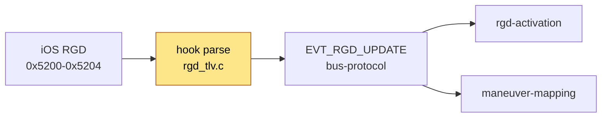

# iAP2 route-guidance TLV map (0x5200-0x5204)

The wire format iOS uses to push route guidance to the accessory, and exactly what our hook parses.
Ground truth = our parser (`rgd_tlv.h`) cross-checked against Apple's own field enum in `accessoryd`.

## 📋 Context

First stop in the route-guidance path - **you are here** turns wire bytes into parsed state:

> iOS RGD -> **rgd-tlv** - parse -> [bus-protocol](../hook/bus-protocol.md) - EVT_RGD_UPDATE -> [rgd-activation](rgd-activation.md) - decide ->
> [maneuver-mapping](maneuver-mapping.md) - icons + [bap-fctids](bap-fctids.md) - HUD

## 📊 Message family

| Msg | Name | Carries |
|---|---|---|
| 0x5200 | StartRouteGuidanceUpdates | source name, `SourceSupportsRouteGuidance`, `SupportsExitInfo` |
| 0x5201 | RouteGuidanceUpdate | the route-level state (table below) |
| 0x5202 | RouteGuidanceManeuverUpdate | one maneuver's detail (type, angles, roads) |
| 0x5203 | StopRouteGuidanceUpdates | teardown |
| 0x5204 | RouteGuidanceLaneGuidanceInformation | per-lane arrows |

## 📊 0x5201 RouteGuidanceUpdate - our IDs match Apple exactly

Every ID matches `+[ACCNavigationRouteGuidanceUpdateInfo keyForType:]` (accessoryd 23G71).
`0x01-0x15` we **parse**; `0x16-0x1A` Apple emits but we **do not parse** (see gaps).

| ID | Apple field (ACCNav_RGUpdate_*) | our field | parsed |
|---:|---|---|:--:|
| 0x01 | RouteGuidanceState | `routeState` | [x] |
| 0x02 | ManeuverState | `maneuverState` | [x] |
| 0x03 | CurrentRoadName | `currentRoad` | [x] |
| 0x04 | DestinationName | `destination` | [x] |
| 0x05 | EstimatedTimeOfArrival | `etaSeconds` | [x] |
| 0x06 | TimeRemainingToDestination | `timeRemaining` | [x] |
| 0x07 | DistanceRemaining | `distDestM` | [x] |
| 0x08-0x09 | DistanceRemaining DisplayString / Units | - | [x] (num used) |
| 0x0A | DistanceRemainingToNextManeuver | `distManeuverM` | [x] |
| 0x0B-0x0C | ...ToNextManeuver DisplayString / Units | - | [x] (num used) |
| 0x0D | RouteGuidanceManeuverCurrentList | `maneuverOrder[]` | [x] |
| 0x0E | RouteGuidanceManeuverCount | `maneuverCount` | [x] |
| 0x0F | **RouteGuidanceBeingShownInApp** | `visible_in_app` | [x] -> [rgd-activation](rgd-activation.md) |
| 0x10 | LaneGuidanceCurrentIndex | `laneGuidanceIndex` | [x] |
| 0x11 | LaneGuidanceTotalCount | `laneGuidanceTotal` | [x] |
| 0x12 | LaneGuidanceShowing | `laneGuidanceShowing` | [x] |
| 0x13 | SourceName | (from 0x5200) | [x] |
| 0x14 | SourceSupportsRouteGuidance | `sourceSupportsRg` | [x] |
| 0x15 | DestinationTimeZoneOffsetMinutes | `destinationTimeZoneMinutes` | [x] |
| 0x16 | StopType | - | [ ] |
| 0x17 | ChargingStationInfoList | - | [ ] |
| 0x18-0x1A | Arrival / Departure / FinalWaypoint BatteryLevel | - | [ ] |

## 📊 0x5202 RouteGuidanceManeuverUpdate - per-maneuver sub-TLVs

| ID | Field | Notes |
|---:|---|---|
| 0x01 | Index | which maneuver slot |
| 0x02 | Description | InstructionText (parsed, not surfaced) |
| 0x03 | Type | EManeuverType 0-53 -> [maneuver-mapping](maneuver-mapping.md) |
| 0x04 | AfterRoadName | turn-to street |
| 0x05-0x07 | DistanceBetween / String / Units | |
| 0x08 | DrivingSide | L/R, mirrors icons |
| 0x09 | JunctionType | roundabout / interchange gate |
| 0x0A | **JunctionElementAngle** | side-street angles |
| 0x0B | **JunctionElementExitAngle** | signed; drives ramp sharpness -> [maneuver-mapping](maneuver-mapping.md) |
| 0x0C | LinkedLaneGuidance | ties maneuver <-> 0x5204 lane event |
| 0x0D | ExitInfo | motorway exit number/name |

## 📊 0x5204 LaneGuidanceInformation

`0x01` LaneGuidanceIndex - `0x02` LaneInformations (per-lane angle vectors) - `0x03` Description.
Up to 8 lanes x 16 angles are kept. The parser also publishes `lgN_lane_complete` (bus key): `1` only
when every nested lane-information TLV was consumed exactly and each lane carried both an index and a
status; an overflow, a trailing byte or a missing field clears it. Detail -> [lane-guidance](lane-guidance.md).

## ✅ Whole-message validation

`rgd_parse_update` / `rgd_parse_maneuver` / `rgd_parse_lane_guidance` return `bool`. Before any field
is copied, `rgd_message_valid` checks the iAP2 header (`40 40`, length == frame length, msgid) and walks
the complete TLV sequence (every `len >= 4` and inside the frame; the 0x5204 LaneInformations container
is validated one level deeper). A malformed message is logged
(`Ignored malformed RGD message 0x52xx`), handed back to stock dispatch unchanged, and **publishes no
partial delta** - nothing reaches the slot caches or the bus. Unknown TLV IDs stay forward-compatible.
Host test: `tests/rgd_tlv_test.c` (run by `scripts/run_tests.sh`).

## 🔄 Route generation

`rgd_maneuver_map_reset` (native route reset) stamps a new `route_generation` from the monotonic clock
(strictly increasing, so it survives a hook restart while Java stays alive). Every snapshot and the
disconnect clear carry it; Java clears route and lane caches when it changes, so a new route that
reuses slot versions never inherits the old route's fields - see [rgd-activation](rgd-activation.md). Hook and JAR must
be deployed together: an older hook sends no `route_generation`.

## Destination time-zone offset

The new parser accepts exactly two bytes, big-endian signed minutes, in the range
`-840..840`. Negative and fractional-hour offsets are preserved; zero means UTC,
not absent. An invalid length/value logs a warning and explicitly clears the
cached offset without rejecting otherwise valid route data. Internal unknown is
`32767`, not `-1`.

The native cache and `RGD_UPD_WRITE_MASK` carry bit 22, publishing
`destination_timezone_minutes`. Java uses the matching dirty bit. A new native
route generation, a changed destination without a replacement offset, a support
hard-clear or disconnect must not reuse the old destination's zone. Omitted
fields in ordinary same-route deltas retain the current value.

**Evidence limit:** the parameter ID is from the accessoryd analysis above.
The iOS 17 [CPRouteGuidance runtime header](https://github.com/MTACS/iOS-17-Runtime-Headers/blob/d1d960dfaa4107765dd7fcf891e4967c0930d5fd/Frameworks/CarPlay.framework/CPRouteGuidance.h)
declares `destinationTimeZoneOffsetMinutes` as signed `short`. The two-byte
big-endian wire interpretation follows that type and the existing RGD integer
encoding; it has not been independently confirmed with a phone capture in this
task. Host tests use synthetic TLVs through the production parser/cache/text
writer and Java/BAP clock conversion. They do not establish whether this iPhone's
Google Maps supplies the field, or validate cross-zone trips in the vehicle.
Unrecognized encodings fall back to HU-local time with a diagnostic.

See [VC route text](vc-route-text.md) for display placement and UTC-duration rules.

## ⚠️ Gaps - Apple sends, we drop

- **0x16 StopType**, **0x17 ChargingStationInfoList**, **0x18-0x1A BatteryLevel** - EV routing
  metadata, unused.
- **0x5202/0x02 Description (InstructionText)** - parsed but not surfaced on the cluster.
